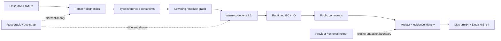

# L# v0.4 — native-first executable language shape

- Status: Proposed next-version design
- Date: 2026-08-01
- Current milestone dependency: v0.3 review provenance / lifecycle remains active
- Decision record: [`decisions-v0.4-next-shape.md`](../../adr/decisions-v0.4-next-shape.md)

## この文書の位置付け

この文書は、v0.3 の未完了項目を完了扱いに移すものではない。v0.3 が保持している
review provenance / lifecycle の contract と、既存の `AGENTS.md` にある Rust-free
selfhost 運用を前提に、次版で L# をどの observable boundary まで持っていくかを固定する
future design である。共有 ChatGPT thread の本文はこの環境では取得できないため、記載する
要件は current repository の `AGENTS.md`、`TODO.md`、v0.3 plan、既存 ADR を一次ソースにした
repo-derived proposal とする。

## 目標: L# のあるべき形

L# は「Rust 実装を削除した言語」ではなく、**L# 自身で開発・検証・Wasm 出力を続けられ、
その意味論と証跡を二つの supported target で再現できる executable contract language** とする。

### 利用者から見た完成形

1. **一つの意味論** — source → parser → 型推論 → lowering → codegen → runtime の各層が
   同じ診断、span、exit code、artifact bytes、stdout/stderr を共有する。Rust oracle は
   differential/bootstrap 用に残るが、native の成功経路を隠す fallback にはならない。
2. **一つの開発入口** — current checkout の source commit/fingerprint と一致する native stage0 が、
   `scripts/native-selfhost-dev.sh` を通じて `check`、`test`、`compile`、`build`、`doc`、`repl`、
   `lsp`、`mcp-server`、`install` を実行する。stale stage0、host `lsharp`、`cargo`、`rustc` は
   成功経路へ暗黙に入らない。
3. **一つの公開 contract** — Rust CLI、selfhost CLI、native stage0、MCP、LSP が同じ入力 schema、
   output schema、診断コード、manifest identity を使う。未対応機能は成功したように見せず、
   安定した診断または明示的な外部境界を返す。
4. **一つの artifact identity** — source commit、target、producer fingerprint、Wasm digest/size、
   review evidence identity、stage0 provenance を同じ canonical representation へ束ね、
   package/fetch/release/rollback の前後で比較できる。
5. **二つの実行 target** — product/release の completion target は Mac Apple Silicon
   (`aarch64-apple-darwin`) と Linux x86_64 (`x86_64-unknown-linux-gnu`) に限定する。両 target で
   current-source stage0、packaged artifact、standalone runtime の証跡が揃わない機能は `[~]` のまま残す。
6. **監査可能な変更** — 各実装は `RED → GREEN → Rust differential → native stage0 →
   artifact/runtime → target matrix → ADR/TODO` の順で閉じる。完了項目は ADR に移し、active TODO
   には未完了の boundary だけを残す。

## 境界モデル

各矢印は別々の completion boundary である。parser の unit test、IR snapshot、summary/header、
Rust host の成功だけでは後段の runtime または target evidence を代用できない。

## レイヤーごとの contract

| レイヤー | 正本の入力 | 成功の観測値 | 失敗時の境界 |
| --- | --- | --- | --- |
| Syntax | source bytes、fixture、module/import | AST、span、formatter bytes、diagnostic code | source error、exit code、stdout/stderr |
| Types | AST、environment、constraints | inferred type、constraint result、diagnostic/span | deterministic type error、Rust/native parity |
| IR / modules | typed AST、module graph | deterministic module order、IR、ftable/import | unsupported feature の明示拒否 |
| Codegen | IR、target、ABI policy | Wasm bytes、imports/exports、digest/size | no artifact、stable codegen error |
| Runtime | Wasm、argv/file/stdin、GC mode | exit code、stdout/stderr、memory/GC metrics | trap、I/O error、resource limit code |
| Public surface | command schema、project root | CLI/LSP/MCP/REPL/install/doc observable output | unknown option/tool、external boundary |
| Release | stage0、source commit、snapshots | package/fetch/rollback identity一致 | stale/mismatch、no implicit provider |

## 運用上の決定

- Rust は stage0 acquisition、再生成、oracle/differential、障害解析、rollback、未移行 host
  integration のために保持する。Rust source の早期削除は v0.4 の目標ではない。
- provider API/authentication は compiler/runtime の責務にしない。caller が trust-store/lifecycle
  snapshot を明示的に用意し、L# は bytes/digest と verification state の境界を記録する。
- Linux VM/stage regeneration は共有 lock と既存 artifact を再利用し、一つの仮説に一つの heavy
  replay だけを許可する。別セッションの active worktree、VM、target artifact は所有確認なしに変更・削除しない。
- CI green、stale artifact、proxy harness、単一 target の成功は v0.4 completion evidence ではない。
- `mcp-server`、unsupported target、provider helper の未移行部分は曖昧な成功を返さず、明示拒否または
  external boundary として report する。

## v0.3 からの引き継ぎ

v0.3 は review attestation / lifecycle / evidence identity の source・selfhost・native・release
接続を閉じる milestone である。v0.4 はその identity を compiler/runtime/public surface の
全体へ広げる。したがって次を v0.4 の前提とする。

- `EC-M3-04` / `EC-M3-05` は Linux x86_64 runtime、provider semantics、packaged provenance、
  rollback parity が残る間は `[~]` のまま。
- `LEGACY-LANG-*`、`LEGACY-COMP-*`、`LEGACY-IO-*`、`LEGACY-TOOL-*`、`LEGACY-BOOT-*` は
  v0.4 milestone の taskへ再分解するが、既存 TODO の aggregateを先に削除しない。
- v0.4 taskの開始は、同じファイル ownership を持つ active branch と競合しない slice に限る。

## 未決定事項

- WasmGC と linear-memory backend の product default をいつ一つへ収束させるか。
- package registry/provider adapter を L# repository 内に置くか、caller-owned external tool として固定するか。
- `verified` / `unverified` / `stale` / `revoked` の report policy を全公開 command へ拡張する最終 schema。
- v0.4 の各 target release artifact を public acquisition gate へ昇格するタイミング。
